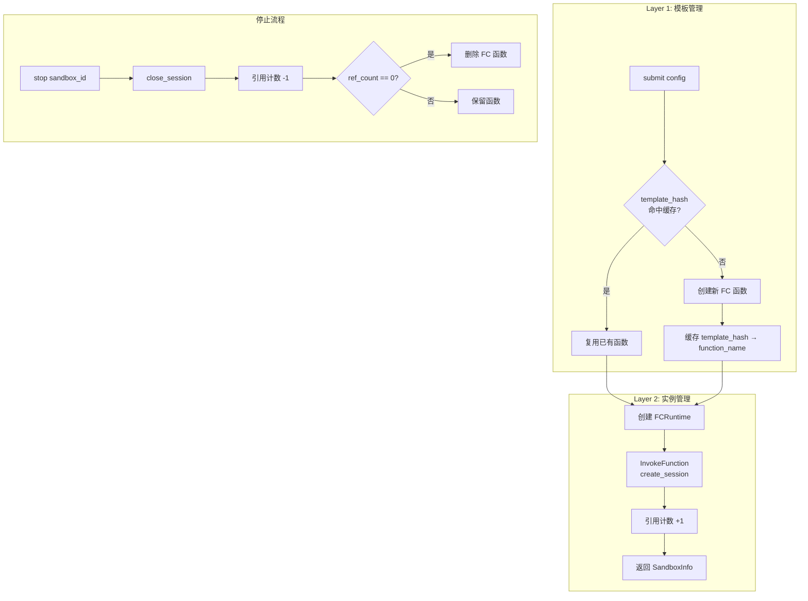
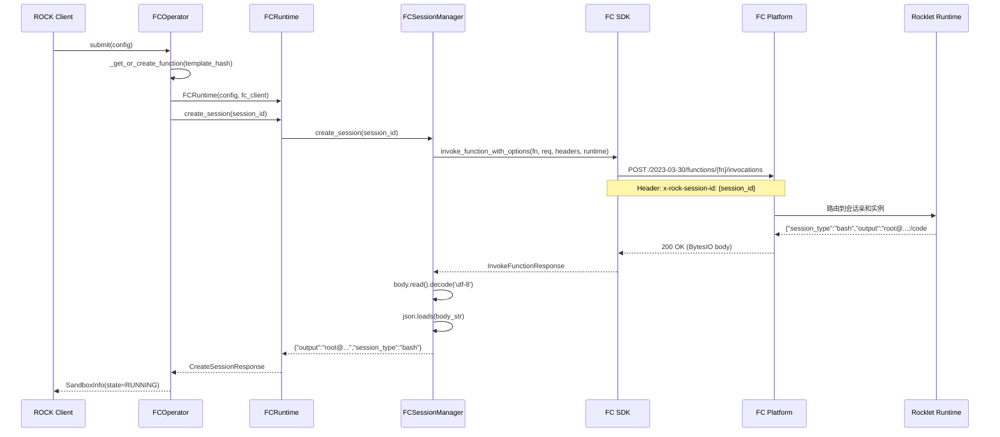

# FC Sandbox Operator 架构设计文档

## 1. 概述

FC Operator 是 ROCK 平台的阿里云函数计算（Function Compute）沙箱操作器，通过 **SDK InvokeFunction + 会话亲和性（Session Affinity）** 实现无服务器环境下的有状态 Bash 会话管理。

### 1.1 设计目标

- **无服务器**：无需管理服务器，按需弹性伸缩
- **有状态会话**：通过 FC Session Affinity 保持 Bash 会话状态（cd、export 等命令持久化）
- **模板复用**：相同配置的沙箱共享 FC 函数，减少冷启动
- **容错韧性**：内置熔断器 + 指数退避重试，保障稳定性

### 1.2 架构位置

```
SandboxManager → FCOperator → FCRuntime → FCSessionManager → FC SDK InvokeFunction
                                          ↕
                                     Rocklet (FC Custom Runtime)
```

FCOperator 作为 `AbstractOperator` 的实现，与 RayOperator、K8sOperator 并列：

| Operator | Backend | 通信方式 | 状态管理 |
|----------|---------|----------|----------|
| RayOperator | Ray Cluster | Ray remote calls | Redis |
| K8sOperator | Kubernetes | HTTP to Pod | Redis + K8s API |
| **FCOperator** | **Alibaba FC** | **SDK InvokeFunction** | **Local dict + Session Affinity** |

---

## 2. 两层架构设计

FC Operator 采用 **模板 + 实例** 的两层架构，将 FC 函数（模板）与沙箱会话（实例）解耦。

### 2.1 Layer 1 - 沙箱模板（FC Function）

**职责**：管理 FC 函数的生命周期，实现配置复用。

每个沙箱模板对应一个 FC 函数，由配置的唯一哈希值标识：

```python
# config.py - 模板哈希计算
def template_hash(self) -> str:
    hash_fields = {
        "image": self.image,              # 容器镜像
        "memory": self.memory,            # 内存规格
        "cpus": self.cpus,                # CPU 规格
        "env": self.env,                  # 环境变量
        "session_ttl": self.session_ttl,  # 会话TTL
        "session_idle_timeout": self.session_idle_timeout,  # 空闲超时
        "function_timeout": self.function_timeout,          # 函数超时
    }
    hash_str = json.dumps(hash_fields, sort_keys=True, default=str)
    return hashlib.sha256(hash_str.encode()).hexdigest()[:16]
```

**复用策略**：
- 相同配置的沙箱共享同一个 FC 函数（函数名 `rock-tpl-{hash}`）
- 引用计数（`_function_refs`）跟踪每个函数的活跃实例数
- 最后一个实例停止时自动删除函数，释放资源

### 2.2 Layer 2 - 沙箱实例（FC Session）

**职责**：管理单个沙箱会话的生命周期。

每个沙箱实例是 FC 函数上的一个会话，通过 `x-rock-session-id` HTTP header 实现会话亲和性：

```
Client → FC SDK InvokeFunction(function, payload, headers={x-rock-session-id: session_id})
                    ↓
         FC Platform 路由到对应实例
                    ↓
         Rocklet 处理请求（Bash 会话状态保持）
```

### 2.3 架构流程图



---

## 3. 核心组件

### 3.1 组件总览

| 组件 | 文件 | 职责 |
|------|------|------|
| FCOperator | `operator.py` | 沙箱生命周期管理，模板复用，引用计数 |
| FCRuntime | `runtime.py` | 沙箱运行时，封装会话操作（create/run/close） |
| FCSessionManager | `runtime.py` | SDK InvokeFunction 调用，重试，熔断 |
| CircuitBreaker | `runtime.py` | 熔断器，防止级联故障 |
| FCOperatorConfig | `config.py` | Operator 配置模型，模板哈希计算 |
| Rocklet | `rock/rocklet/` | FC 自定义运行时，Bash 会话管理 |

### 3.2 FCOperator

```python
class FCOperator(AbstractOperator):
    """两层架构：模板（FC Function）+ 实例（FC Session）"""

    def __init__(self, fc_config: FCConfig):
        self._fc_config = fc_config
        self._runtimes: dict[str, FCRuntime] = {}         # session_id → runtime
        self._function_cache: dict[str, str] = {}         # template_hash → function_name
        self._function_refs: dict[str, int] = {}           # function_name → ref_count
        self._fc_client = None                              # FC SDK Client (懒加载)
```

**核心方法**：

| 方法 | 功能 | 关键逻辑 |
|------|------|----------|
| `submit(config, user_info)` | 创建沙箱 | 合并配置 → 模板复用 → 创建会话 → 引用计数 |
| `get_status(sandbox_id)` | 查询状态 | 本地查找 → is_alive 检查 → 返回状态 |
| `stop(sandbox_id)` | 停止沙箱 | 关闭会话 → 引用计数减1 → 按需删除函数 |
| `cleanup_orphaned_functions()` | 清理孤儿函数 | 列出 `rock-tpl-*` 函数，删除不在缓存中的 |

### 3.3 FCRuntime

FCRuntime 封装了沙箱实例的所有操作，通过 `FCSessionManager` 调用 FC SDK：

```python
class FCRuntime(AbstractSandbox):
    def __init__(self, config: FCOperatorConfig, fc_client=None):
        self.config = config
        self.session_manager = FCSessionManager(config, fc_client=fc_client)

    async def create_session(self, request) -> CreateSessionResponse
    async def run_in_session(self, action: Action) -> Observation
    async def close_session(self, request) -> CloseSessionResponse
    async def execute(self, command: Command) -> CommandResponse     # 无会话直接执行
    async def is_alive(self) -> IsAliveResponse
    async def read_file(self, request) -> ReadFileResponse
    async def write_file(self, request) -> WriteFileResponse
```

### 3.4 FCSessionManager

负责底层 SDK 调用，包含重试和熔断逻辑：

```python
class FCSessionManager:
    DEFAULT_MAX_RETRIES = 3
    DEFAULT_RETRY_BASE_DELAY = 1.0   # 指数退避基数
    DEFAULT_RETRY_MAX_DELAY = 30.0   # 最大退避时间
    SESSION_AFFINITY_HEADER = "x-rock-session-id"

    async def _invoke_function(self, payload, session_id=None, timeout=None) -> dict:
        """核心调用方法：InvokeFunction + 重试 + 熔断"""
        # 1. 检查熔断器状态
        # 2. 构造 InvokeFunctionRequest
        # 3. 设置 x-rock-session-id header
        # 4. 调用 invoke_function_with_options
        # 5. 解析 BytesIO 响应
        # 6. 成功/失败记录到熔断器
```

### 3.5 CircuitBreaker

三级熔断器，防止级联故障：

```
CLOSED (正常) ──连续5次失败──→ OPEN (熔断)
    ↑                            │
    │                      等待30秒
    │                            ↓
    └──连续2次成功── HALF_OPEN (半开)
```

| 参数 | 默认值 | 说明 |
|------|--------|------|
| `failure_threshold` | 5 | 连续失败次数阈值 |
| `success_threshold` | 2 | 半开状态连续成功恢复阈值 |
| `recovery_timeout` | 30.0s | 熔断恢复等待时间 |

---

## 4. SDK InvokeFunction 集成

### 4.1 端点配置

FC 3.0 SDK 的正确端点格式：

```
UID.{region-id}.fc.aliyuncs.com
```

示例：`1273734601317349.cn-hangzhou.fc.aliyuncs.com`

> **注意**：不可使用 `fc-tp.com`（公网不可解析）或 `fc.{region}.aliyuncs.com`（FC 2.0 端点，返回 InvalidVersion）。

### 4.2 请求/响应流程



### 4.3 关键代码：InvokeFunction 调用

```python
# runtime.py - _invoke_function 核心逻辑
from alibabacloud_fc20230330.models import (
    InvokeFunctionHeaders,
    InvokeFunctionRequest,
)
from alibabacloud_tea_util.models import RuntimeOptions

# 1. 构造请求
request = InvokeFunctionRequest(body=json.dumps(payload))
headers = InvokeFunctionHeaders()
runtime = RuntimeOptions(read_timeout=120000, connect_timeout=10000)

# 2. 设置会话亲和 header
if session_id:
    headers.common_headers = {
        self.SESSION_AFFINITY_HEADER: session_id,  # "x-rock-session-id"
    }

# 3. 调用 SDK（通过 asyncio.to_thread 避免阻塞事件循环）
response = await asyncio.to_thread(
    self._fc_client.invoke_function_with_options,
    self.config.function_name,
    request,
    headers,
    runtime,
)

# 4. 解析响应（SDK 返回 BytesIO）
body = response.body
if hasattr(body, 'read'):
    body_str = body.read().decode('utf-8')
elif isinstance(body, bytes):
    body_str = body.decode('utf-8')
else:
    body_str = body if isinstance(body, str) else str(body)
result = json.loads(body_str) if body_str else {}
```

### 4.4 Payload 协议

FC SDK InvokeFunction 的 payload 是 JSON 格式，通过 `action` 字段路由：

```json
{
    "action": "create_session",
    "session": "fc-abc123"
}
```

| action | 必需字段 | 可选字段 | 返回 |
|--------|----------|----------|------|
| `is_alive` | - | - | `{"is_alive": true}` |
| `create_session` | `session` | `session_type` | `{"output":"root@...","session_type":"bash"}` |
| `run_in_session` | `session`, `command` | `timeout` | `{"output":"...","exit_code":0}` |
| `close_session` | `session` | - | `{"session_type":"bash"}` |
| `execute` | `command` | `cwd`, `env`, `timeout` | `{"output":"...","exit_code":0}` |
| `read_file` | `path` | - | `{"content":"...","success":true}` |
| `write_file` | `path`, `content` | - | `{"success":true}` |

---

## 5. 自定义运行时部署（Rocklet）

### 5.1 部署架构

FC Operator 支持两种部署方式：

| 方式 | 运行时 | 特点 |
|------|--------|------|
| 方案 A | `custom-container` | Docker 镜像，需推送 ACR |
| **方案 B** | **`custom.debian12`** | **自定义运行时，预打包依赖，无需 Docker** |

### 5.2 Rocklet 启动链

```
FC Platform
  └── bootstrap (shell 脚本)
       └── python3 -m rock.rocklet --host 0.0.0.0 --port $PORT
            └── __main__.py → server.py:main()
                 └── uvicorn.run(app) → FastAPI
                      └── local_router (API endpoints)
                           ├── POST /          → invoke_dispatch (SDK 调用入口)
                           ├── GET  /is_alive  → 健康检查
                           ├── POST /create_session
                           ├── POST /run_in_session
                           ├── POST /close_session
                           └── POST /execute, /read_file, /write_file, /upload
```

### 5.3 Bootstrap 脚本

```bash
#!/bin/bash
set -e
PORT=${FC_SERVER_PORT:-9000}
CODE_DIR="/code"
DEPS_DIR="$CODE_DIR/deps"
cd "$CODE_DIR"
export PYTHONPATH="$CODE_DIR:$DEPS_DIR:$PYTHONPATH"
exec python3 -m rock.rocklet --host 0.0.0.0 --port "$PORT"
```

### 5.4 Rocklet 适配修改

基于 `rock.rocklet` CLI 入口构建，仅 2 处适配性修改：

1. **`local_api.py`** - 新增 `POST /` 和 `POST /invoke` 根路由分发器，支持 FC SDK InvokeFunction 的统一入口
2. **`local_sandbox.py`** - `import gem` 改为可选导入（`try/except`），适配无 GEM 环境的 FC 沙箱

### 5.5 会话亲和配置（s.yaml）

```yaml
instanceIsolationMode: SESSION_EXCLUSIVE
sessionAffinity: HEADER_FIELD
sessionAffinityConfig:
  affinityHeaderFieldName: x-rock-session-id
  sessionConcurrencyPerInstance: 1
  sessionIdleTimeoutInSeconds: 1800  # 30分钟
  sessionTTLInSeconds: 86400         # 24小时
```

---

## 6. 配置系统

### 6.1 配置层次

```
FCConfig (全局默认)  ←  rock-conf/rock-fc.yml
    ↓ merge_with_fc_config()
FCOperatorConfig (单沙箱配置)
    ↓ template_hash()
模板哈希 (函数复用键)
```

### 6.2 FCOperatorConfig 字段说明

| 字段 | 类型 | 说明 | 默认值来源 |
|------|------|------|------------|
| `function_name` | str | FC 函数名 | FCConfig.function_name |
| `region` | str | 地域 | FCConfig.region |
| `account_id` | str | 阿里云 UID | FCConfig.account_id |
| `access_key_id` | str | AK | FCConfig.access_key_id |
| `access_key_secret` | str | SK (脱敏) | FCConfig.access_key_secret |
| `image` | str | 容器镜像 URL | 必填 |
| `memory` | int | 内存 (MB) | FCConfig.default_memory |
| `cpus` | float | CPU 核数 | FCConfig.default_cpus |
| `session_ttl` | int | 会话最大生命周期 (秒) | FCConfig.default_session_ttl |
| `session_idle_timeout` | int | 空闲超时 (秒) | FCConfig.default_session_idle_timeout |
| `function_timeout` | float | 函数执行超时 (秒) | FCConfig.default_function_timeout |
| `trigger_url` | str | HTTP 触发器 URL (预留) | - |

### 6.3 YAML 配置示例

```yaml
# rock-conf/rock-fc.yml
fc:
  function_name: rock-serverless-runtime-rocklet
  region: cn-hangzhou
  account_id: "1273734601317349"
  access_key_id: "${FC_ACCESS_KEY_ID}"
  access_key_secret: "${FC_ACCESS_KEY_SECRET}"
  default_memory: 4096
  default_cpus: 2.0
  default_session_ttl: 86400      # 24小时
  default_session_idle_timeout: 1800  # 30分钟
  default_function_timeout: 3600  # 1小时
```

---

## 7. 测试架构

### 7.1 测试分层

| 层级 | 文件 | 内容 | 真实 AK/SK |
|------|------|------|------------|
| 单元测试 | `tests/unit/sandbox/operator/fc/` | Mock SDK，验证逻辑 | 否 |
| 集成测试 | `tests/integration/deployments/test_fc_deployment.py` | Mock client，验证交互 | 否 |
| E2E 测试 | `tests/integration/deployments/test_fc_e2e.py` | 真实 FC 调用 | 是（环境变量） |

### 7.2 E2E 测试覆盖

**SDK InvokeFunction E2E（通过 `invoke_function_with_options` 直接调用）**：

| 测试 ID | 内容 | 状态 |
|---------|------|------|
| E2E-FC-SDK-DIR-01 | is_alive 健康检查 | ✅ 通过 |
| E2E-FC-SDK-DIR-02 | create_session 创建会话 | ✅ 通过 |
| E2E-FC-SDK-DIR-03 | 完整生命周期（create→echo→cd→pwd→export→echo→close） | ✅ 通过 |

**生命周期超时测试**：

| 测试 ID | 内容 | 状态 |
|---------|------|------|
| E2E-LIFECYCLE-01 | 超时窗口内会话保持 | ✅ 通过 |
| E2E-LIFECYCLE-02 | 超时后会话状态丢失（实例回收） | ✅ 通过 |

**HTTP 触发器 E2E（通过 curl 调用 fcapp.run URL）**：

| 测试 ID | 内容 | 状态 |
|---------|------|------|
| E2E-HTTP-01 | is_alive | ✅ 通过 |
| E2E-HTTP-02 | create/close session | ✅ 通过 |
| E2E-HTTP-03 | run_in_session（echo, pipe） | ✅ 通过 |
| E2E-HTTP-04 | 文件读写 | ✅ 通过 |
| E2E-HTTP-05 | 直接执行（无会话） | ✅ 通过 |
| E2E-HTTP-06 | 错误处理 | ✅ 通过 |

### 7.3 单元测试结果

```
56 passed, 3 xfailed in 4.62s
```

---

## 8. 关键设计决策

### 8.1 SDK InvokeFunction 替代 WebSocket

| 维度 | WebSocket（旧） | SDK InvokeFunction（新） |
|------|-----------------|--------------------------|
| 通信方式 | 长连接 | 同步 HTTP 调用 |
| 状态管理 | 连接即会话 | Header 路由 + 实例亲和 |
| 冷启动 | 每次连接 | 首次请求 |
| 超时控制 | 连接超时 | RuntimeOptions（read/connect） |
| 重试 | 手动实现 | SDK + 手动双重保障 |
| 适用场景 | 实时交互 | 命令执行 + 文件操作 |

**决策原因**：FC 3.0 推荐使用 InvokeFunction + Session Affinity，简化连接管理，更好利用 FC 平台能力。

### 8.2 模板哈希复用

**决策**：相同配置（镜像 + 资源 + 环境变量 + 超时）的沙箱共享 FC 函数。

**收益**：
- 减少函数创建/删除开销
- 避免重复冷启动
- 引用计数自动管理函数生命周期

### 8.3 预打包依赖（Custom Runtime）

**决策**：使用 `custom.debian12` 运行时 + 预打包 Python wheels，而非运行时 `pip install`。

**原因**：FC 沙箱限制 `pip install`（`operation not permitted`），必须在打包时预装依赖。

### 8.4 两处 Rocklet 适配

**决策**：基于 `rock.rocklet` CLI 入口构建，仅做最小适配修改。

**修改点**：
1. `local_api.py`：新增 `POST /` 根路由，分发 SDK InvokeFunction 请求
2. `local_sandbox.py`：`import gem` 改为可选，适配无 GEM 环境

---

## 9. 文件索引

### 9.1 核心源码

| 文件 | 行数 | 说明 |
|------|------|------|
| `rock/sandbox/operator/fc/operator.py` | 395 | FCOperator - 两层架构核心 |
| `rock/sandbox/operator/fc/runtime.py` | 589 | FCRuntime + FCSessionManager + CircuitBreaker |
| `rock/sandbox/operator/fc/config.py` | 69 | FCOperatorConfig - 配置与模板哈希 |
| `rock/sandbox/operator/fc/__init__.py` | - | 模块导出 |

### 9.2 部署文件

| 文件 | 说明 |
|------|------|
| `rock/sandbox/operator/fc/runtime_example/runtime/s.yaml` | FC 部署配置 |
| `rock/sandbox/operator/fc/runtime_example/runtime/bootstrap` | 自定义运行时启动脚本 |
| `rock/sandbox/operator/fc/runtime_example/runtime/package.sh` | 打包脚本 |
| `rock/sandbox/operator/fc/runtime_example/README.md` | 部署说明 |

### 9.3 Rocklet 适配

| 文件 | 说明 |
|------|------|
| `rock/rocklet/local_api.py` | API 路由 + InvokeFunction 分发器 |
| `rock/rocklet/local_sandbox.py` | Bash 会话管理（gem 可选导入） |
| `rock/rocklet/server.py` | FastAPI 服务器入口 |
| `rock/rocklet/__main__.py` | CLI 入口 |

### 9.4 测试文件

| 文件 | 说明 |
|------|------|
| `tests/unit/sandbox/operator/fc/test_fc_operator.py` | Operator 单元测试 |
| `tests/unit/sandbox/operator/fc/test_fc_runtime.py` | Runtime 单元测试 |
| `tests/unit/sandbox/operator/fc/test_fc_config.py` | Config 单元测试 |
| `tests/unit/sandbox/operator/fc/test_fc_factory.py` | Factory 单元测试 |
| `tests/integration/deployments/test_fc_deployment.py` | 集成测试（Mock） |
| `tests/integration/deployments/test_fc_e2e.py` | E2E 测试（真实 FC） |

### 9.5 配置文件

| 文件 | 说明 |
|------|------|
| `rock-conf/rock-fc.yml` | FC 全局配置 |
| `rock/config.py` | FCConfig 定义 |
| `openspec/fc_operator_refactoring_proposal.md` | 重构方案文档 |

---

## 10. E2E 验证结果

### 10.1 SDK InvokeFunction 完整生命周期

```
1. Create:  root@c-6a413414:/code#       (session_type=bash)     ✅
2. Echo:    hello_sdk                      (exit_code=0)           ✅
3. CD:      (empty output)                 (exit_code=0)           ✅
4. PWD:     /tmp                           (exit_code=0, 状态持久化) ✅
5. Export:  (empty output)                 (exit_code=0)           ✅
6. Env:     42                             (exit_code=0, 环境持久化) ✅
7. Close:   session_type=bash                                      ✅
```

### 10.2 生命周期超时验证

**配置**：`sessionIdleTimeoutInSeconds: 60`

```
Step 1-3: create → cd /tmp → pwd=/tmp        ✅ (超时前状态正常)
Step 4:   等待 70 秒（60s timeout + 10s buffer）
Step 5:   pwd → SessionDoesNotExistError     ✅ (实例已回收，状态丢失)
结论:     PASS - 超时后 FC 平台回收实例，会话状态全部丢失
```

### 10.3 端点验证

| 端点格式 | DNS 可解析 | API 版本 | 结果 |
|----------|-----------|----------|------|
| `UID.{region}.fc.aliyuncs.com` | ✅ | 2023-03-30 | **正确** |
| `UID.{region}.fc-tp.com` | ❌ NXDOMAIN | - | 不可用 |
| `fc.{region}.aliyuncs.com` | ✅ | 2016-08-15 | InvalidVersion |
